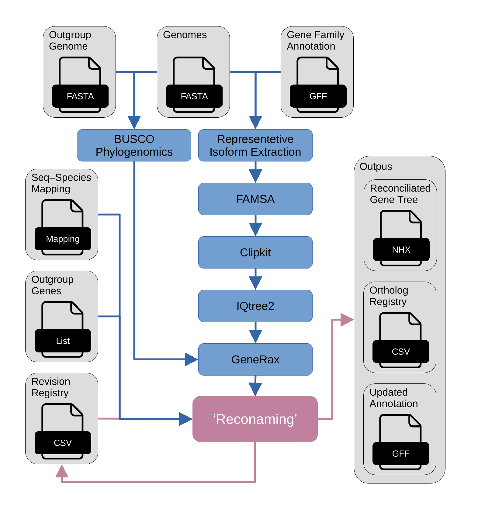

# Reconaming

Orthology-aware multigene-family reconciliation and naming.

> **Status: beta / under active development**
>
> The standalone core script is publicly available as a beta version.
> The Nextflow pipeline is currently under construction and is **not yet
> functional as an end-to-end workflow**. Its modules and interfaces may change
> substantially before the first usable release.

## Current contents

- `full_beta_reconaming_core_script_v6.py`: current beta version of the core
  reconciliation and naming script.
- `main.nf`, `modules/`, and `bin/`: Nextflow workflow under development.
  These files do not yet constitute a runnable analysis pipeline.

## Citation

If you use Reconaming, please cite it using the information in
[`CITATION.cff`](CITATION.cff).

## Licence

Reconaming is distributed under the
[GNU General Public License v3.0 or later](LICENSE).
